

# 🐾 PetGo

**A direct-to-consumer (B2C) pet e-commerce platform — built mobile-first, USA-first, multi-country by design.**

 

  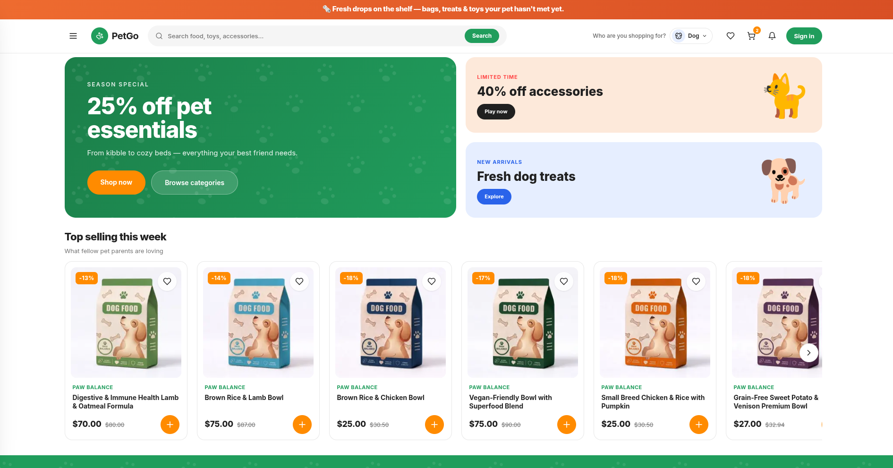

---

## ✨ What is PetGo?

PetGo is a full-stack **direct-to-consumer (B2C)** pet e-commerce platform engineered for pet parents — offering food, toys, accessories, and health products. While created as a portfolio and learning project, its engineering follows enterprise-grade architecture: electronic tax documents, regional shipping rules, cash on delivery, and multi-country expansion are modeled cleanly into the schema rather than retrofitted.

The storefront targets the **United States** as its launch market, with the underlying data model and pricing rules already equipped to onboard **Colombia** and **Peru** without schema changes (currencies, tax rates, locales, and shipping zones are per-country configurations).

> **Note** — The core source code is maintained in a private repository. This repository serves as the official public showcase and architectural overview.

---

## 📸 Visual Tour

A visual walkthrough of the PetGo web experience across discovery, shopping, personalization, and customer account workflows:

| 01. Storefront Home & Discovery | 02. Mega Category Menu |
|:---:|:---:|
|  | 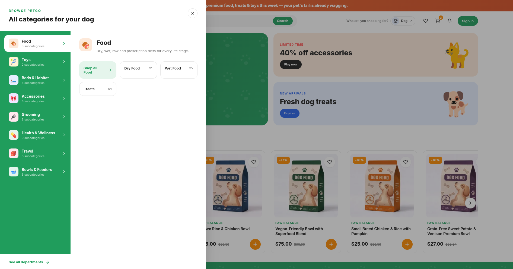 |
| **03. Weekly Deals & Promotions** | **04. Dynamic Search & Multi-Facet Filters** |
| 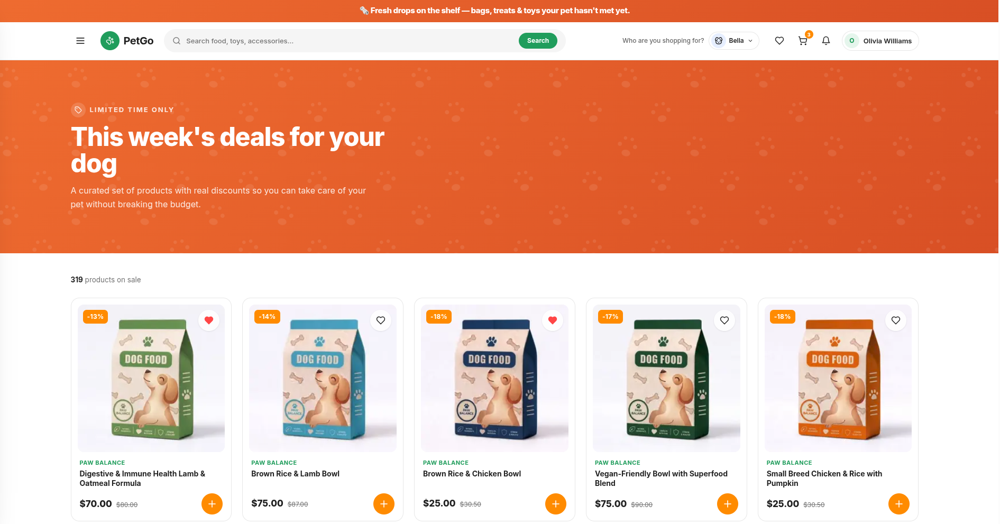 | 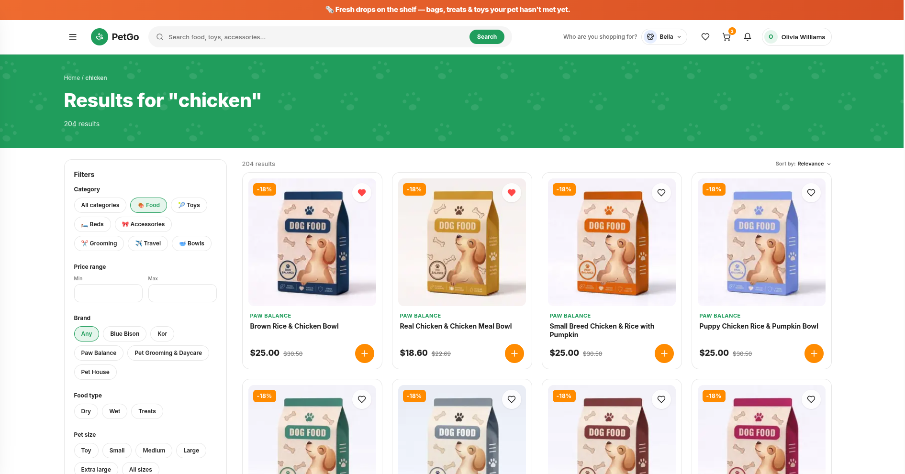 |
| **05. Instant SSR Rails & Personalized Picks** | **06. Pet-Aware Favorites & Allergy Shield** |
| 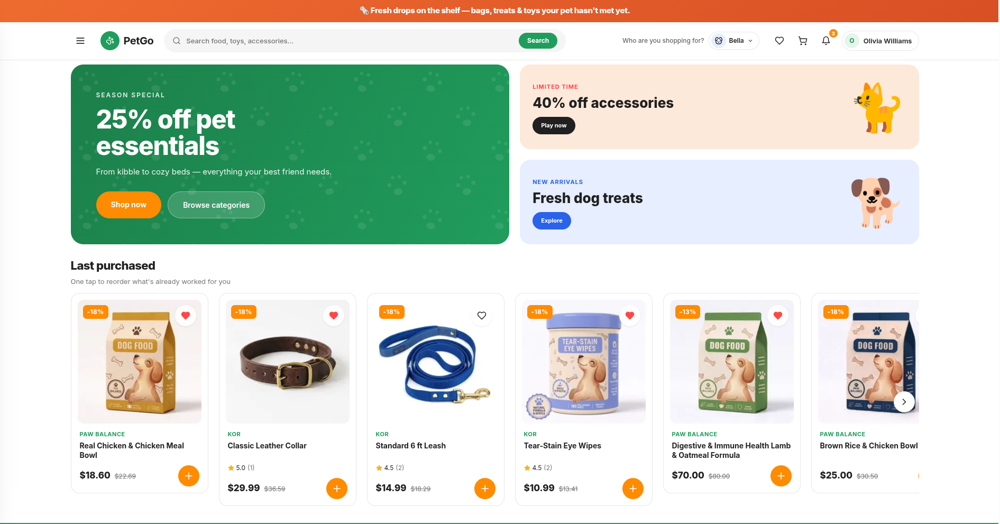 | 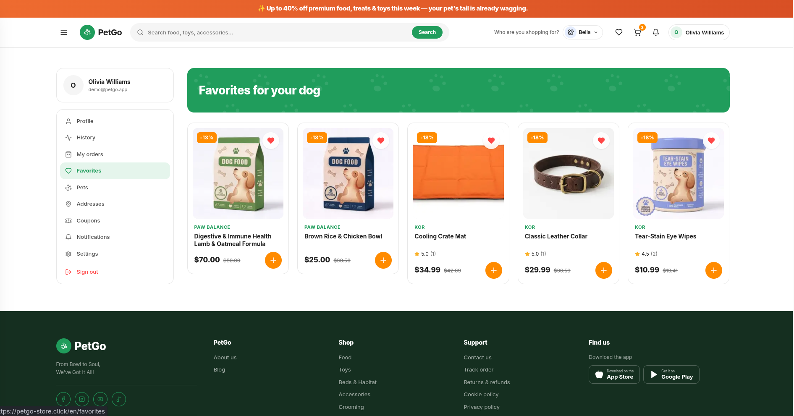 |
| **07. Shopping Cart & Free Shipping Goal** | **08. Streamlined Checkout & Payment** |
| 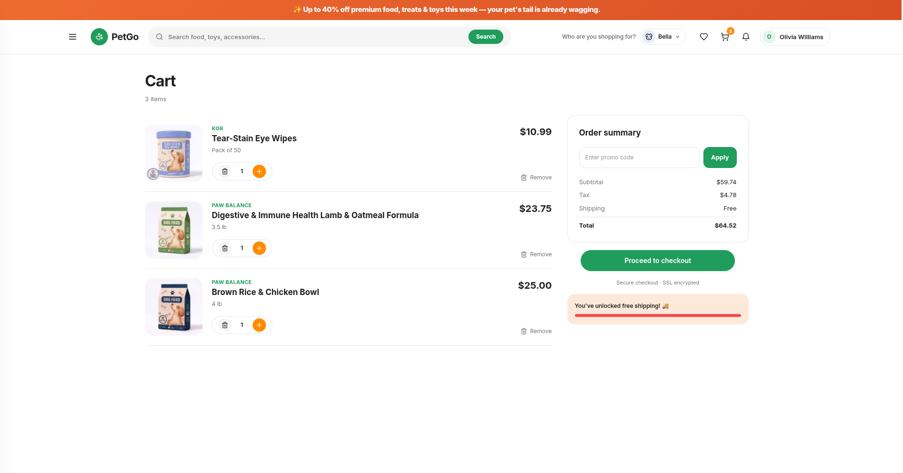 | 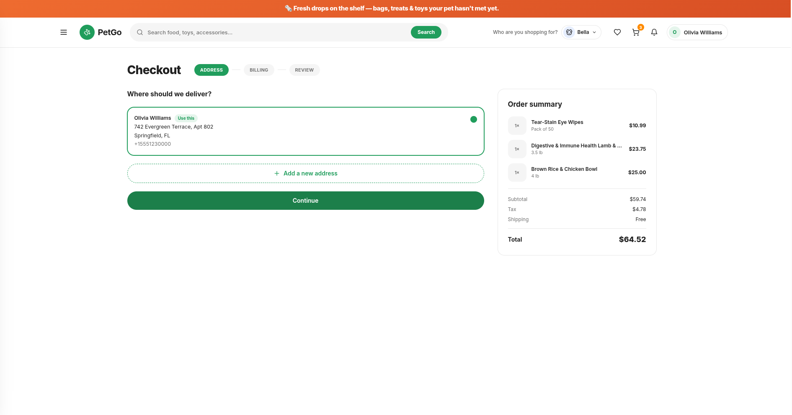 |
| **09. Order History & One-Tap Reordering** | **10. Pet Profiles & Active Roster Switcher** |
| 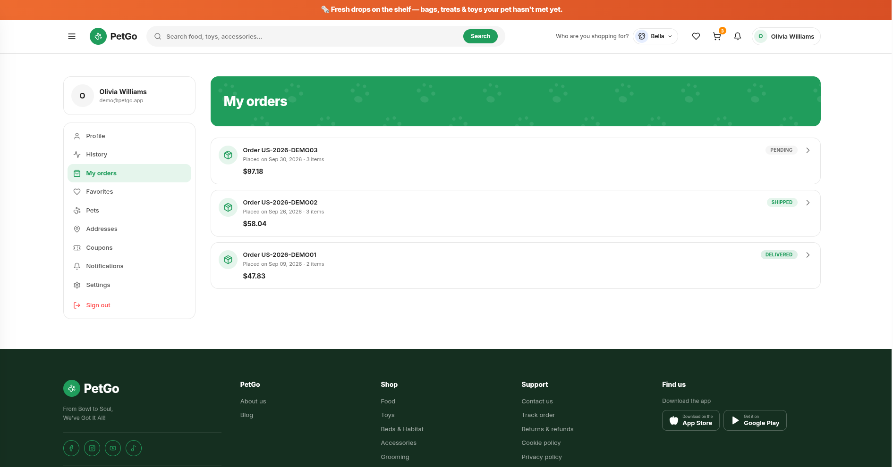 | 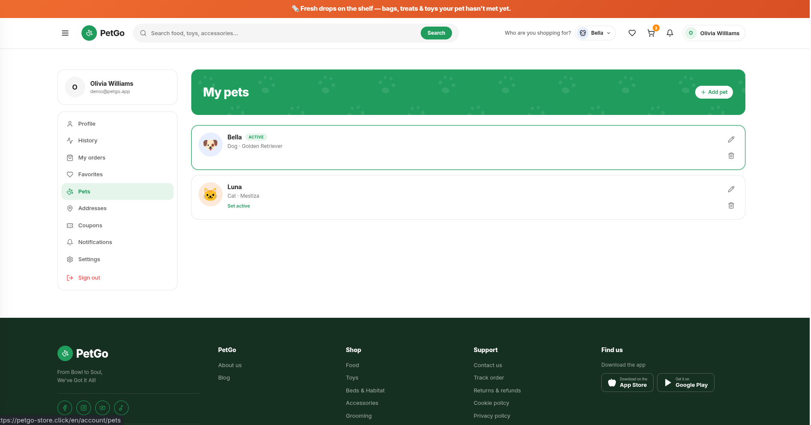 |
| **11. Real-Time In-App Notifications** | **12. Clean Authentication & Security** |
| 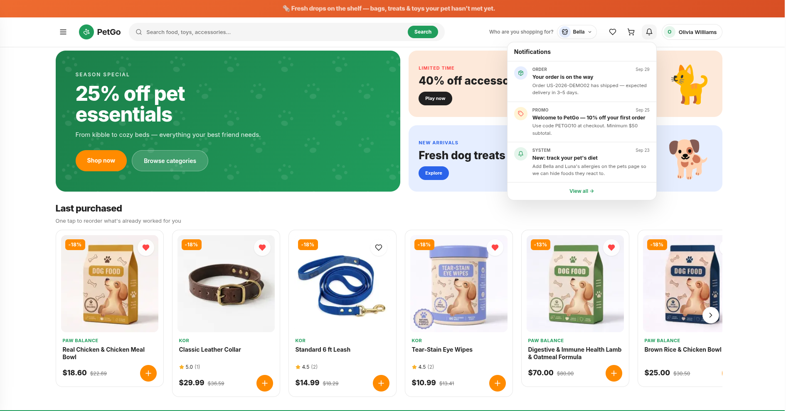 | 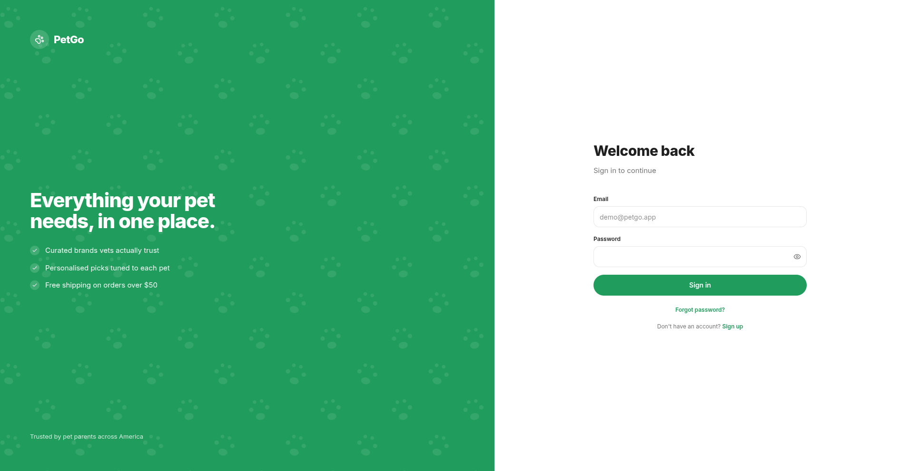 |

---

## 🎥 Live Application

Experience the live storefront directly in your browser:

🔗 **[petgo-store.click](https://petgo-store.click)**

---

## 🧱 Tech Stack

| Layer | Technologies & Libraries |
|---|---|
| **Storefront** | Next.js 15 (App Router) · React 19 · Turbopack · Apollo Client v4 · Serwist (PWA) · Tailwind v4 · next-themes · next-intl |
| **API Backend** | Bun runtime · Hono · GraphQL Yoga · better-auth · Drizzle ORM · DataLoader registry · Resend |
| **Database** | PostgreSQL (Neon serverless in production) |
| **Email Service** | Resend (transactional auth OTPs & password recovery) |
| **Monorepo & Tooling** | Bun Workspaces · Turborepo · Biome linter/formatter · GraphQL Code Generator (client-preset + fragment masking) |

---

## 🎯 Architecture & Feature Highlights

### 🌐 High-Performance Storefront

- ⚡ **Zero-Skeleton Initial Paint**: Apollo Client v4 + RSC integration with `PreloadQuery` pre-renders catalog carousels and top-selling rails on the server, eliminating layout shifts and delayed loading skeletons.
- 🐾 **Server-Synchronized Species Preload**: Fast `petgo_species` cookie sync allows the Next.js edge server to immediately prefetch products matching the customer's active pet (Dog or Cat) before client-side hydration.
- 🛡️ **Active-Pet Allergen Guard**: The catalog automatically filters or flags ingredients containing proteins that the shopper's active pet is allergic to across discovery rails, category trees, and product details.
- 🌎 **Bilingual Internationalization (EN / ES)**: Native localized routing (`/en/...` and `/es/...`) via `next-intl` with localized currencies, shipping threshold bars, and tax summaries.
- 🛒 **Unified Guest & Account Cart**: Session tokens power guest cart persistence and seamlessly claim carts into the customer's account upon authentication.
- 📦 **Resilient Catalog Media**: Graceful branded paw fallback artwork for items with missing or retired product images.
- 🌗 **Adaptive Themes**: Refined light and dark modes with dedicated brand palettes powered by `next-themes`.
- 📲 **Progressive Web App (PWA)**: Installable web app with Service Worker caching and custom offline fallback pages powered by Serwist.

### 🔌 Robust GraphQL API

- 🧱 **3-Layer Hexagonal Architecture**: Every feature is split cleanly into **Resolvers** (GraphQL schema plumbing), **Services** (domain rules & validations), and **Repositories** (Drizzle ORM queries).
- ⚙️ **DataLoader Batching**: Hand-crafted DataLoader registry guarantees zero N+1 database queries when joining product variants, images, brand data, and review score aggregates.
- 🔐 **Authentication & Security**: Email + password login, password-reset OTP verification via Resend, and bearer tokens engineered for cross-origin security.
- 🛡️ **Defensive API Stack**: GraphQL Armor depth and cost limiting, IP-level rate limiting, strict CORS allowlists, disabled production introspection, and automated scanner blocking.
- 🚚 **Transactional Inventory**: Atomic stock verification during checkout prevents overselling and handles partial stock gracefully.

### ✅ Rigorous Automated Testing

- **182 unit tests (100% pass rate)** across 18 test suites executed in milliseconds via `bun:test`.
- **Financial & Order Integrity**: Deep test coverage for cart totals, coupon logic (percentage, fixed amount, and free shipping), tax rules, and order transitions.
- **IDOR Multi-Tenant Guardrails**: Explicit security tests verifying that customer-scoped records (pets, favorites, addresses, orders) reject foreign user IDs with clean `NotFoundError` exceptions.

### 🚀 Production Infrastructure & DevOps

- **Storefront**: Hosted on Vercel with automatic CI/CD deployment from `main`.
- **API Server**: Packaged as a lightweight multi-stage Docker container (~150MB) running on a Google Cloud Platform (GCP) Compute Engine e2-micro instance.
- **Global DNS**: Managed through AWS Route 53 with automated HTTPS certificate provisioning.
- **Observability**: Vercel Analytics and Speed Insights tracking Core Web Vitals in real-time.

---

## 👋 Author

Designed and engineered by **Miriam Acuña**.

- 💼 **LinkedIn**: [Miriam Acuña](https://www.linkedin.com/in/miriam-acuna-enciso/)
- 🌐 **Portfolio**: [miriacode.vercel.app](https://miriacode.vercel.app)
- 🐙 **GitHub**: [@miriacode](https://github.com/miriacode)
